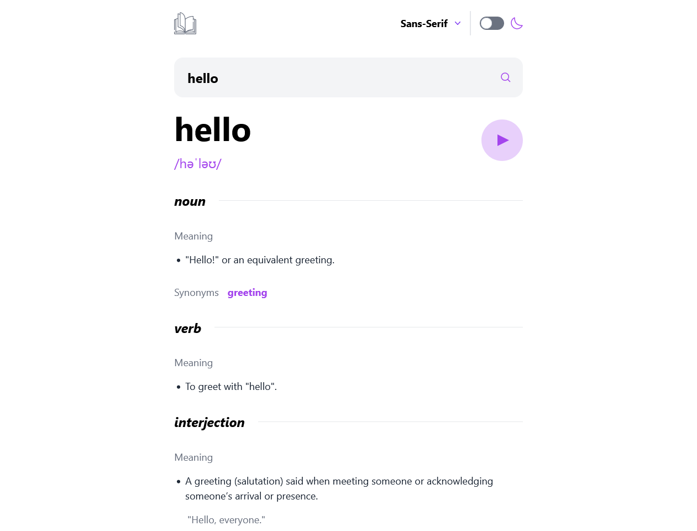

# Dictionary web app

This is a solution to the [Dictionary web app challenge on Frontend Mentor](https://www.frontendmentor.io/challenges/dictionary-web-app-h5wwnyuKFL). Frontend Mentor challenges help you improve your coding skills by building realistic projects. 

## Table of contents

- [Overview](#overview)
  - [The challenge](#the-challenge)
  - [Screenshot](#screenshot)
  - [Links](#links)
- [My process](#my-process)
  - [Built with](#built-with)
  - [What I learned](#what-i-learned)
  - [Continued development](#continued-development)
- [Author](#author)

## Overview

### The challenge

Users should be able to:

- Search for words using the input field
- See the Free Dictionary API's response for the searched word
- See a form validation message when trying to submit a blank form
- Play the audio file for a word when it's available
- Switch between serif, sans serif, and monospace fonts
- Switch between light and dark themes
- View the optimal layout for the interface depending on their device's screen size
- See hover and focus states for all interactive elements on the page
- **Bonus**: Have the correct color scheme chosen for them based on their computer preferences. _Hint_: Research `prefers-color-scheme` in CSS.

### Screenshot

### Links

- Solution URL: [Frontend Mentor Solution](https://your-solution-url.com)
- Live Site URL: [Live Site](https://dictionary-web-app-thnd-82aolm33t-mike-is-coding.vercel.app/)

## My process

### Built with

- Semantic HTML5 markup
- CSS custom properties
- Javascript
- Flexbox
- Mobile-first workflow
- [React](https://reactjs.org/) - JS library
- [Next.js](https://nextjs.org/) - React framework
- [Typescript](https://www.typescriptlang.org/) - Gives type syntax
- [Tailwind.CSS](https://tailwindcss.com/) - For styles
- [Flowbite](https://flowbite.com/) - Tailwind Components

### What I learned

I jumped into this project to learn mostly about interacting with API's. However, I got much more than I could have hoped out of this project. I learned a lot about using strongly typed languages like Typescript which was quite difficult for me at first, but eventually I learned how helpful it can be in creating bug-free code. 

I also learned to use Next.js built on top of React.js. Next.js allowed me to simplify and condense my code, but I think it would more useful in a full-stack application that interacts with the server.

I had used other stylesheet languages like SASS before, but for this project I wanted to use something different. That is why I went with Tailwind. I had heard some things about it and after using I can see how it would be helpful for useful for small projects. However, for me it seemed to be more of a hassle to use, and very confusing, than regular css stylesheets.

### Continued development

For future projects I would very much like to continue working with Typescript and Next.js. I also would like to practice more with using API's as I struggled somewhat fetching the data. 

## Author

- Website - [Miguel Fierro](https://www.miguelfierro.dev/)
- Frontend Mentor - [@Mike-is-coding](https://www.frontendmentor.io/profile/Mike-is-coding)
